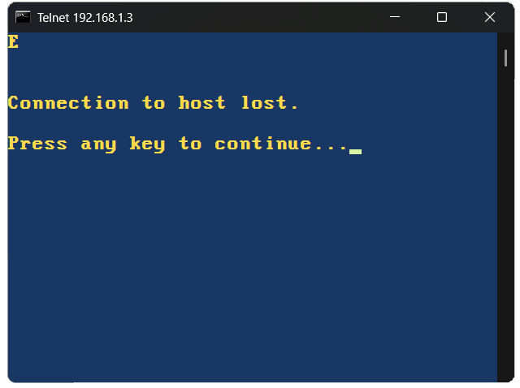

E is a 483-byte sizecoding experiment Win32 Telnet server written in x86 assembly and built with MASM and Crinkler. It listens on port 5555, accepts one connection, sends back its own name "E" and exits. I started with a simple C server to see how small the same program could become in assembly.

### E runs on all versions of Windows from 2000 to 11.



The entire history for this project in source code is included. The file names contain the version numbers and brief descriptions. Starting with 000 is the C telnet server, extremely basic. I forget why I had the sleep timer in there but it is removed later anyway.

### Every build was tested by connecting from an Apple II.

Version 001 is the direct conversion to x86. Version 002 begins the process of breaking everything down. By version 006 we're using Crinkler and really going for it. At 015 we leave off at 483 bytes. I think there may be more to go, but this is good for now.

For me the biggest surprise was this:
```
original C simple telnet server          - 90112 bytes CL build
original C no CRT & heavy CL size opts   -  1536 bytes CL OPT SIZE build        
convert orig C to assembly               -  3072 bytes MASM
```
The largest size reduction of the entire project by far was accomplished with the linker and no code changes. I quite wanted to get a Tiny C Conplier (TCC) build working to see the result, but I couldn't get around needing to have winsock2.h sitting there next to e.c and that voids the whole point of the project. I didn't try GCC.

The style used was commenting out old code instead of removing it. A number of things went in and out several times along the way. I didn't preserve the failues.

```
Walkdown from 90K to 483 bytes:

start with working version in C          - 90112 bytes exe size
original C no CRT & heavy CL size opts   -  1536 bytes 
first version in MASM                    -  3072 bytes
replace invokes with push/call           -  3072 bytes
remove dup error handles                 -  3072 bytes
first crinker build                      -   558 bytes
remove htons import & hard-code port     -   551 bytes
remove ZeroMemory (win does the init)    -   533 bytes
remove sleep - not needed                -   529 bytes
switched to ebx/esi                      -   521 bytes
   ebx = listening socket
   esi = client socket
combined mov AF_INET and mov 0B315h      -   517 bytes
switched IPPROTO to eax protocol zero    -   515 bytes
removed shutdown - let socket default    -   510 bytes
reduce wsa to actual size (400)          -   509 bytes
shortened the message to server name "E" -   493 bytes
let wsacleanup dispoose of the socket    -   487 bytes
fall-thu redundant INVALID_SOCKET check  -   484 bytes
moved addr_in from data? to data         -   483 bytes
```
